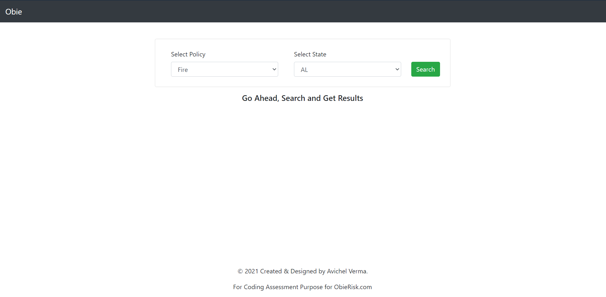
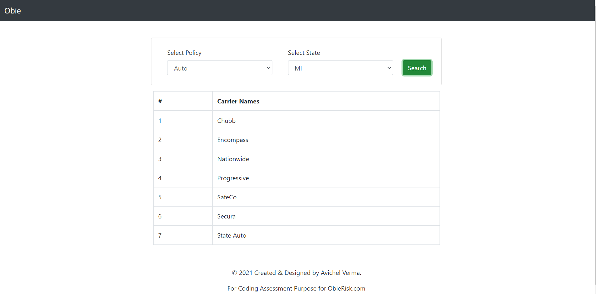

# Obie Engineering Challenge
## _Obie Brokerage App_

### About
Obie is a commercial real estate brokerage. Fundamentally, when a client needs an insurance policy, we find a carrier that is able to provide it. 

For example, a client might say, "I need auto coverage in Michigan." To which a broker might answer, "Great! I'll reach out to my favorite carrier in that state: Nationwide." 

What makes this complicated is that not all carriers are the same. 

1. Not all carriers operate in all states. 
2. Not all carriers offer all polices. 
3. The policies that a carrier offers might even vary from state to state.

### The Challenge

Currently, our brokers navigate the process of finding a carrier using a google sheet.

- Please create a single page app, that allows a user to change appropriate fields, and see which carriers meet the criteria.
    - For example: when a user selects Auto Insurance in Michigan, the page *should* show Allstate as an option. When they change the state to Indiana, Allstate should *not* be shown as an option.
- (optional) Please transform the spreadsheet into an API. This API can take whatever form you choose, but you must be able to explain your choices.

### My Approach to this Challenge
There are two supersets namely, PL and CL. There are five types of policy coverages *Fire,Auto,Both,Flood,State Apt* that are offered by various carriers in different states.

First, I've written a script in JavaScript that scraps the information from the workbook and store it into 4 collections named after the four policies. And in these respected collection, it holds a Key:Value pair of State:List of carriers. And further storing it into MongoDB.

With the help of Express server backend, the GET `/api/search` endpoints receives the requests and respondes back with a body that contains the list of carrier for the following policy name and state.

This makes our frontend client lightweight for faster loading of the application and relaying on the backend to process and return with proper results.

### Future Scope
- To make it easier for the Admin to update the values in the database, I would build an interface that would provide the functionality of CRUD operations to the database. This would save the time of updating the workbook.
- And also, we can put a button on the dashboard that would run the script to update the database again, if the Admin wants to perform updation in the workbook.
- With theses above approach, we can avoid manually copying the spreadsheet data into our code and make it more friendly for the Admin.
### About the Stack
I have built a Full-Stack Web Application using MERN Stack (MongoDB, Express, React, Nodejs). It is designed with two key functional areas:

#### 1. Backend
The `./api` directory contains an REST Express server that follows **MVC sturcture, and 3-Layer Architecture**. The database of choice is **MongoDB**. The reason for this choice of database is to have a collection of various policies, namely *FIRE, AUTO, BOTH, FLOOD, and STATE APT.* The schema for this collection is:
```
{
    name:"fire"   // the policy name
    // state_carrier stores an object with Key:Value pair of stateAbbv:List of carrier names
    state_carrier: {
        IL: [...],
        MI: [...],
        ...
    }
}
```
##### Reasons:
- The reason for this approach is to have faster read from the database and returning back a response quicker.
- I have written a custom script for scrapping the workbook file and writing data into MongoDB. The script can be found in `./scripts`.

#### 2. Frontend
The frontend is built using React. I have utilised React-Bootstrap to speed up the frontend development process and Axios as HTTP client library for sending HTTP requests and managing responses.

### Getting Started
The Technologies used in stack:
- React
- MongoDB
- Express
- Nodejs
- Javascript
- Mocha and Chai [Javascript Test Framework]

#### Project Folder Structure
```
/
|-- api
|   |-- controllers     # Express controllers that responds to requests.
|   |-- models          # Database models
|   |-- repository      # Repository that communicates with the database
|   |-- routes          # Manages routes to controller
|   |-- scripts         # Custom script for importing dataset from workbook to database
|   |-- services        # Encapsulates all business logic
|   |-- test            # Contains the test scripts
|   `-- index.js        # Entry point for application
|-- screenshots
|-- src
|   |-- components      # Various Components in React
|   |   |-- Header      # Header Component
|   |   |-- Footer      # Footer Component
|   |   |-- ListItem    # List-Items Component
|   |-- utils
|   |-- App.js
|   |-- App.scss
|   |-- index.js  
```
#### Running Server
**To run the express server locally:**
Before starting local express server. First make sure to start MongoDB server and keep it running. Secondly, Drop the ObieTestDB, and after that run the following command to start the script and server using `npm start`. This will run the preprocessing script first, and then express server.
```
mongod // to run MongoDB server
cd api
npm start
```
**To run the react app:**
```
cd /
npm start
```
**Testing the API Endpoint:**
To run the tests, navigate to api folder, and the mongodb server should be running and the ObieTestDB should be present in database. Run the following commands
```
cd api
npm test
```
### API Reference Guide

##### Status Code
- 200 - Success Code
- 400 - Bad Request
- Errors are returned in json format
```
{
    'success': False,
    'message': 'Invalid Policy Type'
}
```

#### API Endpoints
All the endpoints will be routed through `/api` 
##### GET /search
- Returns a list of carriers.
- Sample endpoint: `http://localhost:4000/api/search?name=auto&state=IL`
- Returns the following object
```
{
    "success":true,
    "carriers":["Allstate","Auto Owners","Bristol West (High Risk Auto)","Chubb","Encompass","Founders","National     General","Nationwide","Progressive","SafeCo","Secura","State Auto","Travelers"]
}
```

### Screenshot

- Screenshot of Mocha Testing

- Landing Page

- Broker select auto coverage in Michigan. Nationwide is present but not Allstate.


### Author
- Avichel Verma developed the following application; Successfully tested the API using Mocha and Chai.
